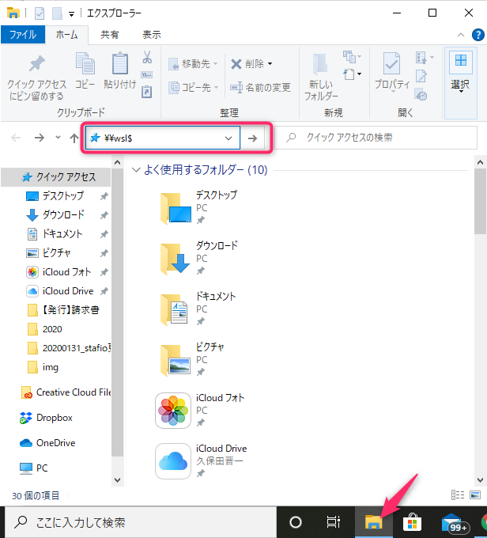
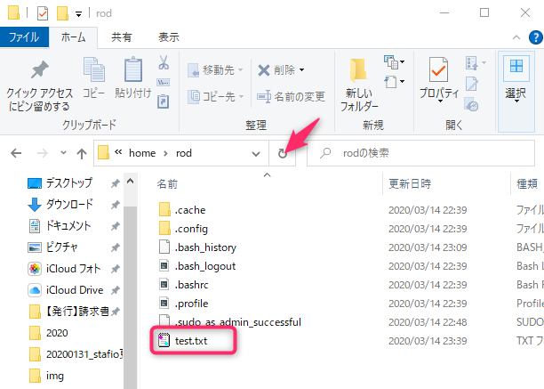
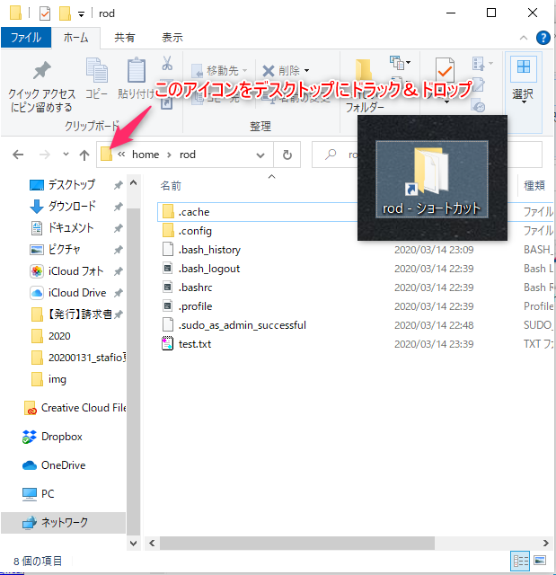

# Windowsの場合の環境構築

WindowsでPHPの開発環境を構築する方法はいくつかあるのですが、今回はWSL（Windows Subsystem for Linux）という機能を使用してPHPの開発環境を構築してみます。  

今回は以下の手順で環境を構築していきます。

```
1. WSLを使用してWindowsでLinuxを利用できるようにする
2. Macの標準的なパッケージマネージャーのHomebrewをインストールする
3. PHPをインストールする → ここまででとりあえずOK！
4. VSCodeでWSL環境のターミナルを使えるようにする
```

環境構築にあたり、前提条件として以下の環境が必要です。

```
* OS：Windows10
* メモリ：8G 以上
* HDD：残り10G 以上
```


## 1.WSLを使用してWindowsでLinuxを利用できるようにする
### 1.1. WSLの有効化

まずは、WSL機能を有効化します。  
Windowsのメニューにある検索ボックスに『powershell』と入力すると、Windows Poershellアプリが表示されるので、『管理者として実行する』をクリックします。  
※右クリックから管理者として実行でも大丈夫です。

Powershellが起動するので、以下のコマンドを入力します。

【注意】この教材のコマンドは原則コピペするようにしてください。1文字のミスで原因追求に膨大な時間を浪費することになります

```
Enable-WindowsOptionalFeature -Online -FeatureName Microsoft-Windows-Subsystem-Linux
```

これを実行するとWSLが有効になります。

実行後に「この操作を完了するために、今すぐコンピューターを再起動しますか？」と表示されますので「Y」もしくは「Yes」と入力して、再起動を行ってください。  
※既に有効な場合は再起動は起きないのでそのまま進めて下さい。

PCを再起動後にWSLが有効になったか確認してみましょう。  
再度上記の操作でpowershellを起動したら、以下のコマンドを実行して『State』という項目が『Enabled』になっていれば有効化完了です。

```
Enable-WindowsOptionalFeature -Online -FeatureName Microsoft-Windows-Subsystem-Linux
```

### 1.2. Microsoft storeからUbuntuをインストールする
WSLを有効化したら、実際に動作させるLinuxをインストールします。  
今回はUbuntuというLinux系のOSを使用します。

Windowsのメニューにある検索ボックスに『microsoft store』と入力すると、Microsoft Storeアプリが表示されるのでクリックします。  
そうするとMicrosoft Storeが起動します。

Microsoft Storeが起動したら、検索窓に『linux』と入力してください。  
そうするといくつかWSLで利用できるアプリが表示されます。

今回は『Ubuntu 20.04 LTS』を利用しますのでクリックします。  
※もし見つからない場合は『Ubuntu 18.04 LTS』または『Ubuntu』を使用しましょう。

『Ubuntu 20.04 LTS』をクリックすると詳細ページに遷移するので『インストール』ボタンをクリックしてインストールしましょう。  
インストールが完了すると『インストール』ボタンが『起動』ボタンに変わるのでクリックして起動しましょう。


### 1.3.1 ユーザー名とパスワード設定
『Ubuntu 20.04 LTS』をインストールして、起動したら初期設定をしていきましょう。  
暫く『Installing, this may take a few minutes...』と表示されるので待ちます。


### 1.3. ユーザー名とパスワード設定
『Ubuntu 20.04 LTS』をインストールして、起動したら初期設定をしていきましょう。  
暫く『Installing, this may take a few minutes...』と表示されるので待ちます。

```
Enter new UNIX username: rod   # ← 任意のユーザー名を入力
Enter new UNIX password:         # ← 任意のパスワードを入力
Retype new UNIX password:        # ← パスワードを再度入力
passwd: password updated successfully
Installation successful!
To run a command as administrator (user "root"), use "sudo <command>".
See "man sudo_root" for details.
```


### 1.3.2. 最新版にアップデートする
インストールしたらUbuntuを最新版にします。  
以下のコマンドを実行してパッケージを最新に更新します。  
『apt』はパッケージ管理コマンド、『sudo』は管理者(root)権限を利用するコマンドです。

```
sudo apt update -y && sudo apt dist-upgrade -y
```
sudoを実行しようとするとroot権限のパスワードを求められるので、最初に設定したパスワードを入力します。


### 1.3.3. 日本語環境設定をする
次に日本語の設定にしておくと扱いやすいので日本語設定をしておきましょう。

以下のコマンドでタイムゾーン（時刻設定）を変更します。  
実行すると設定画面が現れてゾーンの設定ができますので 『Asia → Tokyo』と選択しましょう。
```
sudo dpkg-reconfigure tzdata
```

次にロケール（言語）を設定します。  
以下のコマンドを実行してください。

```
sudo apt install locales
sudo apt install -y language-pack-ja
sudo update-locale LANG=ja_JP.UTF-8
```

最後にman(マニュアル)も日本語版を入れておきましょう。  
以下のコマンドを実行してください。
```
sudo apt install -y man manpages-ja manpages-ja-dev
```
これでWSLの初期設定は完了です。  


### 1.4. WSLのファイルの場所
WSLはWindows上で動作しています。  
なので、WSL上のファイルはWindowsからも操作することができます。

まずはWSL上で今自分がどのディレクトリにいるのかを確認してみましょう。
```
pwd
```
上記のコマンドを打つと恐らく /home/[ユーザー名] と表示されると思います。これを覚えておいてください。

そして、今度はWindowsメニューからフォルダのアイコンをクリックすると『エクスプローラー』が開きます。  
エクスプローラーは普段ファイルとかを探している画面です。

ここの上の窓に『\\wsl$』と入力してEnterボタンを押してください。  
そうすると、『Ubuntu 20.04 LTS』というフォルダが見えていると思います。  
これがWSLのフォルダです。



そこから、さきほどpwdコマンドで調べたパスに移動してみましょう。  
\\wsl$\Ubuntu-18.04\home\[ユーザー名] と進んでみてください。  
ここが先ほどWSLの中でいた場所になります。

では、本当にそうなのかを確認してみましょう。  
WSLの画面の方で、以下のコマンドを実行してみてください。  
```
touch test.txt
```

そして、lsコマンドでファイルがあるかを見てみましょう。
```
ls
```
そうすると、test.txt というのが表示されると思います。

今度はWindowsのエクスプローラーで見てみましょう。  
画面を更新するために更新ボタンを押すと、test.txtが表示されたと思います。



※画像の場合のユーザー名は`rod`です

今度はWindowsのエクスプローラーでtest.txtを削除してみましょう。  
text.txtを右クリックして削除をします、そうするとエクスプローラーからtext.txtが消えましたね。  
そして、WSLからlsコマンドを実行してみるとtext.txtが表示されなくなったはずです。  
これでWSL上のファイルがWindowsでも操作できることがわかりました。  


### 1.5. ショートカットを作成
このフォルダは今後作業を進める上で良く使用するのでショートカットを設置しましょう。  
このフォルダの左上にあるフォルダのアイコンをそのままデスクトップにドラック&ドロップしてください。  
これでいつでもこのフォルダに移動できるようになりました。




### 1.6. WSLの起動と終了
最後に、WSLのUbuntuを終了する方法と、起動する方法です。  
WSLの環境を終了する時は以下の終了コマンドを実行してください。
```
exit
```

WSLの環境を起動したい場合は、Windowsのメニューにある検索ボックスに『ubuntu』と入力すると、『Ubuntu 20.04 LTS』アプリが表示されるのでクリックするとWSL環境が起動します。


## 2. Macの標準的なパッケージマネージャーのHomebrewをインストールする。
つぎはMacで標準的に使用されるパッケージマネージャーのHomebrewを入れていきましょう。  
HomebrewをいれることでMacの人とほぼ同じ環境で作業を進めることが出来るようになります。

インストールは以下の公式の手順に沿っていきます。

https://docs.brew.sh/Homebrew-on-Linux

まずは最新に更新します。  
実行するとroot権限のパスワードを求められるので、先ほど設定したパスワードを聞かれるので入力してください。
```
sudo apt-get update && sudo apt upgrade
```

次に、Homebrewをインストールするのに必要な依存関係をインストールします。  
これでgitも使えるようになります。
```
sudo apt-get install -y build-essential curl file git
```

次にHomebrew本体のインストールをします。  
このコマンドの時はsudoはしないように気を付けてください。
```
sh -c "$(curl -fsSL https://raw.githubusercontent.com/Linuxbrew/install/master/install.sh)"
```
途中でEnterを押すことを求められるので押します。

次に、インストールが終わったらHomebrewをbrewコマンドとして利用できるようにPATHを通します。
```
test -d ~/.linuxbrew && eval $(~/.linuxbrew/bin/brew shellenv)
test -d /home/linuxbrew/.linuxbrew && eval $(/home/linuxbrew/.linuxbrew/bin/brew shellenv)
```

設定出来たら、このままだとWSLを再起動すると設定が消えてしますので/.profileファイルに設定を追記します。
```
echo "eval $($(brew --prefix)/bin/brew shellenv)" >>~/.profile
echo 'export LD_LIBRARY_PATH="$LD_LIBRARY_PATH:/home/linuxbrew/.linuxbrew/lib"' >> ~/.profile
source ~/.profile
```

これで、設定完了です。  
試しにbrewを使用してパッケージをインストールしてみましょう。  
slコマンドという、lsのタイポジョークコマンドをインストールしてみます。
```
brew install sl
```

インストールが成功したら、以下のコマンドを実行してみて下さい。  
SLが画面を駆け抜けたら成功です。
```
sl
```


## 3. PHPをインストールする
PHPをインストールします。  
実行するとインストールするか確認されますので`y`と入力してください。
```
sudo apt install php7.4
```

バージョン確認をして以下のように表示されればきちんとインストールできています。
```
PHP 7.4.3 (cli) (built: Jul  5 2021 15:13:35) ( NTS )
Copyright (c) The PHP Group
Zend Engine v3.4.0, Copyright (c) Zend Technologies
with Zend OPcache v7.4.3, Copyright (c), by Zend Technologies
```


## 4. VSCodeでWSL環境のターミナルを使えるようにする
Windowsのメニューから『Ubuntu 20.04 LTS』アプリを選択することでWSL環境のターミナルが起動しますが、VSCodeでWSL環境のターミナルを使用したい場合が出てくると思います。  
VSCodeでWSL環境のターミナルを使えるように設定をしましょう。


### 4.1. VScodeをインストール
VScodeのインストールがまだの場合はインストールします。  
この際、VScodeは必ずWindows側（\\wsl$から始まらないディレクトリ）にインストールしてください。


### 4.2. VScodeに拡張機能を追加する
次にRemote DevelopmentのためのVScode拡張機能を追加します。  
まずはインストールしたVScordを立ち上げてください。  
(Cont + Shift + X)で拡張機能を表示し、「Marketplace で拡張機能を検索する」というテキストボックスに「Remote Development」と入力してください。
検索結果に「Remote Development」の拡張機能が表示されていますと思いますので、installボタンを押してインストールしてください。  
インストールが終了したら、VScodeに設定を反映させるため、VScodeを一度閉じてください。


### 4.3. WSL環境からVScodeを起動する
WSL環境からからVScodeを起動します。  
Windowsのメニューから『Ubuntu 20.04 LTS』アプリを選択し、WSL環境が起動してください。  
その後以下のコマンドを実行してください。
```
cd
code .
```
`code .`または`code-insiders .`を実行するとVScodeが開きます。  
（初回のインストール時はVScodeが開くまで暫く時間がかかります）  
VScodeが開いたら、左下に`WSL: <ディストリビューション名(例：Ubuntu 20.04)>`という表示が出ていることを確認してください。  
表示ができていれば接続成功です。

以後、左下に`WSL: <ディストリビューション名>`が表示されている状態で、(Cont + Shift + @)を入力するとWSL環境のターミナルが使用できます。


### 4.4. VScodeからVScodeからRemote WSLを使用し、WSL環境のターミナルを使用する
4.3.までの設定を行うとWSL環境からコマンドでVScodeを起動すること（3.3.までの設定）が不要になります。

F1キーを押してRemote-WSL: New Window using Distroを選択して、使いたいディストリビューションを選びます。  
すると左下に`WSL: <ディストリビューション名>`が表示された新しいウィンドウが開きますので、(Cont + Shift + @)を入力すると、WSL環境のターミナルが使用できます。